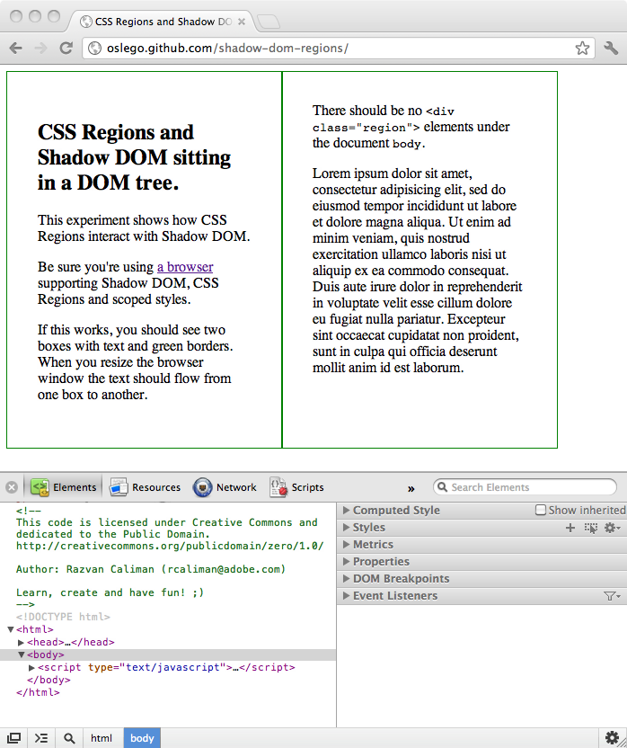

CSS Regions in Shadow DOM
=====

This is an experiment to hilight how CSS Regions interact with Shadow DOM. 

Requirements
-----
This experiment works in a Webkit-enabled browser with Shadow DOM, CSS Regions and scoped styles enabled.    

At the time of this writing - March 2012, Google Chrome Dev channel and Google Chrome Canary builds have Shadow DOM, CSS Regions and scoped styles support.

[Download Google Chrome Canary](http://tools.google.com/dlpage/chromesxs)       

**How to enable Shadow DOM in Google Chrome**

* type `about:flags` into the address bar of the browser;

* find the "Enable Shadow DOM" flag and toggle it on; 

* restart the browser;    

* [test if Shadow DOM works](http://jsfiddle.net/dglazkov/eQSZd/)
                                                                               
**How to enable CSS Regions in Google Chrome**

* type `about:flags` into the address bar of the browser;

* find the "Enable CSS Regions" flag and toggle it on;

* restart the browser;

* [test if CSS Regions work](http://jsfiddle.net/vwmpX/) 

**How to enable scoped styles in Google Chrome**

* type `about:flags` into the address bar of the browser;

* find the "Enable &lt;style scoped&gt;" flag and toggle it on;

* restart the browser;

* [test if scoped styles work](http://jsbin.com/ehutuc/edit#preview)  

Expected result
-----
You should see two green border boxes with text flowing between them when the browser window is resized. 
There should be no placeholder `
` elements in the page source, outside the Shadow DOM.

**Screenshot of expected result**

  
     

Troubleshooting
-----
If your browser meets all requirements but you don't see the expected result try enabling the WebInspector, AKA "Developer Tools" in Google Chrome, and switch to the "Elements" tab. This should kick-start the CSS Regions + Shadow DOM behavior.                                                                                                                                                                                                                                                                                                                                                                    